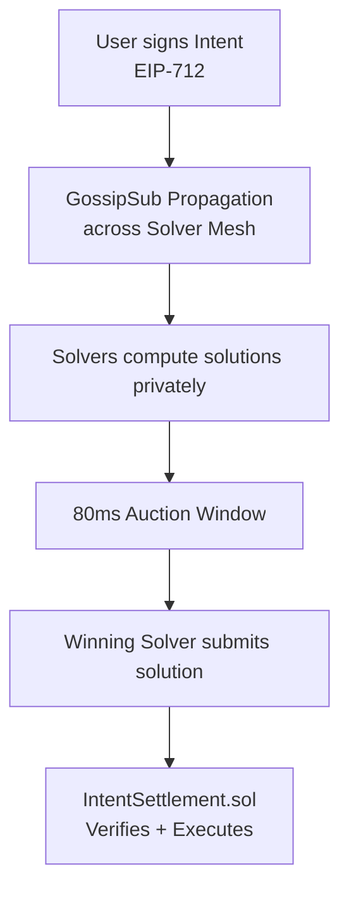

<div align="center">
        
# Lattice

**Private solver mesh powered by Js-libp2p. Intents settled before the chain sees them.**

<p align="center">
  <a href="#"></a>
  <a href="#"></a>
  <a href="#"></a>
  <a href="#"></a>
</p>

<div align="center">

</div>

</div>


# Intro

**Lattice** is an **intent-based DeFi coordination layer** built on **js-libp2p**.  

Users sign what they want. Solvers compete **privately** to fill it. The best solution lands on-chain. 

**No mempool exposure. No MEV leaks. No trusted relayer.**


> It earns the name on three levels — gossip (GossipSub is the propagation engine), lattice as in ultra-fine mesh fabric (the solver subnet topology), and the connotation of something fast and nearly invisible.

> That last part is exactly what good infrastructure feels like.


# The problem it solves

- Modern DeFi leaks intent data too early. The moment a swap hits a public RPC or mempool, searchers can front-run it. Existing solver networks patch this with centralized off-chain APIs — which defeats the point.

- Lattice moves coordination entirely peer-to-peer: intents propagate through an encrypted solver mesh, auctions resolve in under 100ms, and only the winning solution touches the chain.


# DEMO

[Watch Demo](https://teal-secondary-antelope-34.mypinata.cloud/ipfs/bafybeief2j7zoo4dw4czinwzaumgfyzahwex5vjmny2a4gbrpcfidmgohe)

> For demonstration, Lattice runs as a local multi-node simulation entirely in the terminal — spin up one bootstrap node, two or three solver nodes, and a user node using scripts, then fire a test intent through the gossip mesh using a simple CLI script that calls buildAndSignIntent() with a hardcoded wallet, publishes it to the GossipSub mesh, and prints each hop in real-time: intent received → validated → solver bids → auction winner → settlement tx hash. That's the demo — watching an intent travel from user signature to on-chain settlement in under 100ms, fully logged in the terminal, no browser needed.

<div align="center">
  <table>
    <tr>
      <td align="center">
        
        <!-- <br><strong>js-libp2p Powered</strong> -->
      </td>
      <td align="center">
        
        <!-- <br><strong>Lattice Mesh Demo</strong> -->
      </td>
    </tr>
  </table>
</div>

## How it works



- The _Networking_ layer is **js-libp2p** — Noise-encrypted connections, yamux multiplexing, Kademlia DHT for discovery, GossipSub for intent propagation. 
- The _Trust_ layer is **EVM** — solver staking, slashing, and on-chain settlement via EIP-712 verified signatures.


## Architecture at a glance

| Layer | Component | Role |
|---|---|---|
| Transport | WebSocket + Noise XX + yamux | Encrypted, multiplexed peer connections |
| Discovery | Kademlia DHT + Bootstrap | Solvers find each other at startup |
| Propagation | GossipSub (2 topic tiers) | Intent gossip — public and tier-1 meshes |
| Validation | Topic validators | Sig check + deadline + registry, ~1.3ms |
| Negotiation | `/defi/rfq/1.0.0` streams | Direct solver-to-solver bid exchange |
| Settlement | `IntentSettlement.sol` | On-chain verify, execute, pay solver |
| Trust anchor | `SolverRegistry.sol` | Stake, register, slash — PeerID ↔ EVM binding |


## Latency budget (80ms auction window)

```
Intent propagation to solvers     10–20ms
Solver pathfinding + compute      20–40ms
Bid return to coordinator         10–20ms
Auction resolution                 5–10ms
Buffer                            10–15ms
─────────────────────────────────────────
Total                             ~80ms
```

Pre-warmed libp2p connections reduce dial time from ~50ms cold to ~2ms. This is non-negotiable for the budget to hold.


## Roadmap

### Phase 1 — Foundation
- [x] **1.1** js-libp2p solver node — Noise, yamux, WebSocket, GossipSub, DHT
- [x] **1.2** Peer discovery — bootstrap list, Kademlia DHT, connection pre-warming
- [x] **1.3** `SolverRegistry.sol` — stake, register, slash, PeerID → EVM address binding

### Phase 2 — Intent Gossip & Validation
- [x] **2.1** Intent schema — EIP-712 typed struct, protobuf wire format, `intentId` as GossipSub `messageId`
- [x] **2.2** GossipSub topology — 2-tier topic routing (`public` / `tier-1`), mesh tuned for sub-100ms
- [x] **2.3** Validation pipeline — sig verify → deadline → registry cache (60s TTL + event invalidation)

### Phase 3 — Solver RFQ & Auction Engine
- [x] **3.1** `/defi/rfq/1.0.0` stream protocol — direct encrypted solver negotiation, sealed bids
- [x] **3.2** Auction coordinator — 80ms hard deadline, `Promise.race`, parallel RFQ broadcast
- [x] **3.3** Solver compute engine — DEX pathfinding (Uniswap v3 / Curve), route encoding

### Phase 4 — EVM Settlement & Incentives
- [x] **4.1** `IntentSettlement.sol` — verify EIP-712 intent + bid, execute route, pay solver
- [ ] **4.2** Solver incentive model — fee split, slashing conditions, reputation → tier access

### Phase 5 — Hardening & Launch
- [ ] **5.1** Latency benchmarking harness — per-hop timing, p99 profiling, geo simulation
- [ ] **5.2** MEV resistance audit — timing attacks, solver collusion vectors, commit-reveal analysis


## Design decisions (locked)

| Decision | Choice | Rationale |
|---|---|---|
| Partial fills | No (v1) | Complexity without volume justification |
| Auction window | Protocol-fixed 80ms | Users can't reason about latency |
| Solver nodes | Server-only (always-on) | Browsers can't hit sub-100ms reliably |
| Topic tiers | 2 (public + tier-1) | Single leaks; 3 premature pre-scale |
| Registry check | Cache + event invalidation | Fresh RPC (50–200ms) kills budget |

---

## Arbitrum Sepolia — mesh → settlement

End-to-end flow is **user** (`scripts/run-user.js`) over GossipSub → **solver** (`scripts/run-solver.js`) → optional **`IntentSettlement.settle`**.

### Prerequisites (one-time per user wallet)

**Token approval is required before your first intent settles.** The solver calls `settle()` which pulls tokens from your wallet via `transferFrom`. Approve once (or with a high allowance) and you won't need to repeat until exhausted:

```bash
# Approve USDC (6 decimals) for IntentSettlement
cast send 0x75faf114eafb1BDbe2F0316DF893fd58CE46AA4d \
  "approve(address,uint256)" \
  $SETTLEMENT_CONTRACT_ADDRESS \
  1000000000 \  # 1000 USDC — adjust as needed
  --rpc-url "$ARB_SEPOLIA_RPC" \
  --private-key "$PRIVATE_KEY"
```

### Environment (repo-root `.env`)

```bash
PRIVATE_KEY=0x...
ARB_SEPOLIA_RPC=https://arb-sepolia.g.alchemy.com/v2/YOUR_KEY
ARB_SEPOLIA_CHAIN_ID=421614

# Contract addresses (both required)
SETTLEMENT_CONTRACT_ADDRESS=0x...   # IntentSettlement — nonces + settle
REGISTRY_CONTRACT_ADDRESS=0x...     # SolverRegistry — solver stakes

# Optional solver tuning
# USE_QUOTER=1                      # call QuoterV2 for honest bids (adds ~10-30ms)
# SOLVER_MARGIN_BPS=10              # shade bids by 0.10% for heterogeneity
# RFQ_DIAL_TIMEOUT_MS=60            # default 60ms WS; set 40 for QUIC
```

### Run the solver

```bash
node scripts/run-solver.js
# Logs its PeerID and multiaddr — copy for user's BOOTSTRAP_PEERS
```

With `SETTLEMENT_CONTRACT_ADDRESS` set and `AUTO_SETTLE` not `false`, the winning bid auto-submits on-chain.

### Run the user

```bash
BOOTSTRAP_PEERS=/ip4/127.0.0.1/tcp/9000/ws/p2p/<solverPeerId> \
  node scripts/run-user.js
```

The user reads `settlement.nonces(wallet)` to sign the correct nonce. If the deployed contract lacks the `nonces()` passthrough (pre-v1.1), set `REGISTRY_CONTRACT_ADDRESS` as fallback.

### Demo


| Goal | Contract | Notes |
|---|---|---|
| Full **`settle` tx** on Sepolia without SwapRouter failures | **`MockIntentSettlement`** | Deploy via `forge script ... deployMock(address)` (see [`contracts/README.md`](contracts/README.md)). Say: *coordination + trust layer is real; AMM execution is pluggable.* |
| Real Uniswap path | **`IntentSettlement`** | Often hits empty / illiquid pools on testnet — use for infra debugging, not as the only demo. |
| Credible **mesh** evidence | 2–3 solvers | Different `SOLVER_PORT`, shared `BOOTSTRAP_PEERS` to first solver’s multiaddr. One solver + one user is RFQ/local-compute valid but not a full mesh story. |


### Troubleshooting

| Error | Cause | Fix |
|---|---|---|
| `execution reverted (no data)` on `nonces()` | Deployed contract lacks `nonces()` passthrough | Redeploy contract OR set `REGISTRY_CONTRACT_ADDRESS` |
| `Nonce mismatch` | Intent signed with stale nonce | Re-run `run-user.js` (reads fresh nonce) |
| `transferFrom` reverts | User hasn't approved settlement | Run approval command above |
| `Solver not registered` | Solver wallet not in registry | Run `node scripts/register-solver.js` |
| HTTP 429 from RPC | Rate limited | Use keyed RPC; increase `RPC_429_EXTRA_MS` |

### Operations notes

Public Sepolia gateways aggressively **429** rate-limit. **Prefer a keyed provider** (Infura / Alchemy / QuickNode).

The repo configures a gentler ethers client in **[`node/rpc-provider.js`](node/rpc-provider.js)** (`batchMaxCount=1`, tunable **`RPC_POLLING_INTERVAL_MS`**, **`RPC_429_EXTRA_MS`** default long sleep on HTTP 429). **`submitSettlement`** wraps critical calls in **back-off retries**.

If logs show **`settle revert`** with **`require(false)`** or a selector-only hex, the chain often surfaced **no `Error(string)`** — commonly **`SwapRouter.exactInput`** (path / liquidity / token quirks), not gossip. Prefer **keyed RPC + `cast call … settle.staticCall`** (or Tenderly) to isolate. To drop one RPC hop on flaky endpoints, set **`SETTLE_GAS_LIMIT`** (e.g. `800000`) so **`estimateGas`** is skipped after a successful **`staticCall`**.

Maintainership narrative when things fail: mesh + signing can succeed while **`settle` fails** — that’s **orthogonal layers** (P2P vs EVM infra). Showing **decoded revert where possible**, **429 retries**, and a **commercial RPC** proves production thinking.

---

## Tech stack

| Concern | Choice |
|---|---|
| P2P networking | js-libp2p v1.x |
| Transport | WebSocket (TCP) |
| Encryption | Noise XX |
| Multiplexing | yamux |
| Pub/sub | GossipSub |
| Wire format | Protobuf (protobufjs) |
| EVM signing | ethers v6 (EIP-712) |
| Smart contracts | Solidity 0.8.34  |
| Runtime | Node.js 20+ (ESM) |

---

*Lattice — the mesh is the protocol.*
